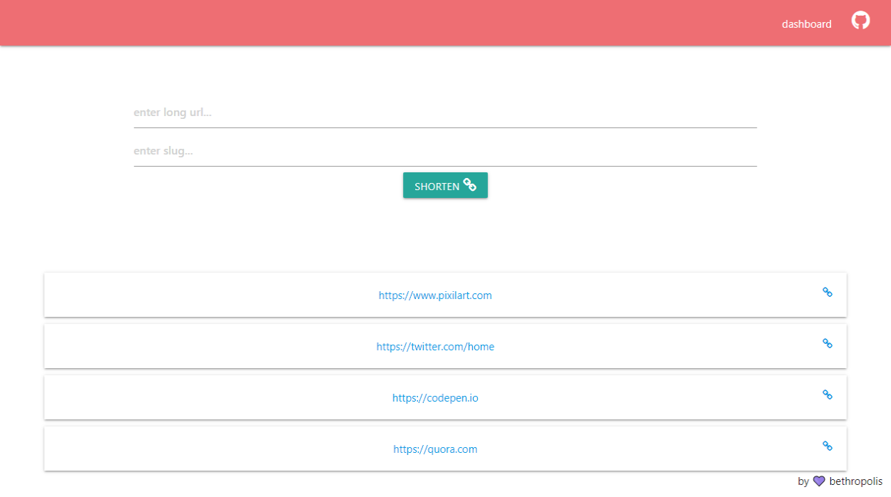
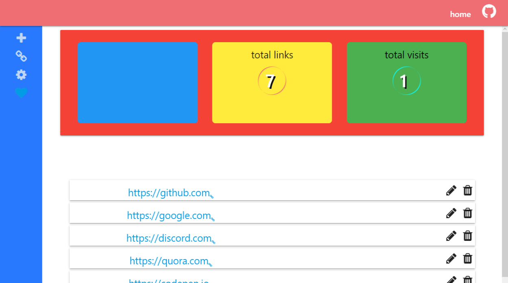
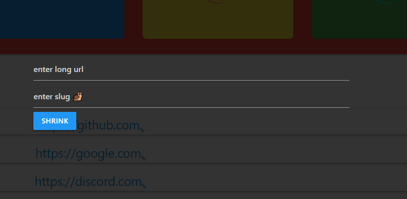
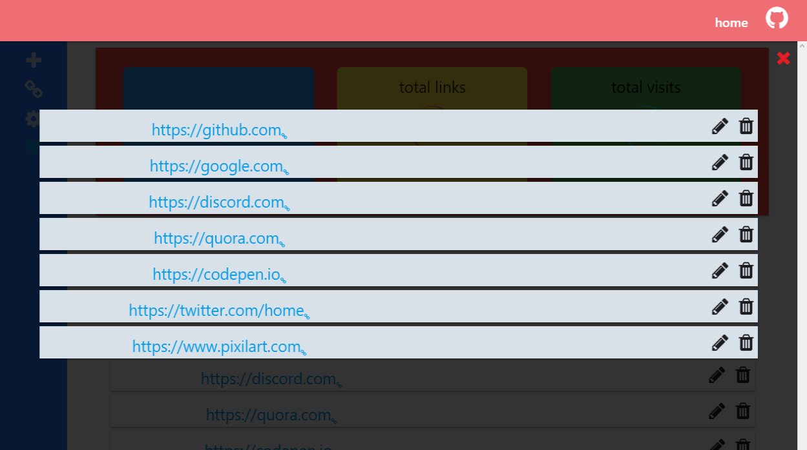

# Url Shortener

## table of content

* [installation](#installation)
  * [requirement](#requirement)
  * [getting started](#getting-started)
* [features](#features)
  * [main page](#main-page)
  * [dashboard](#dashboard)
  * [dashboard features](#dashboard-features)
  * [dashboard shortcuts](#dashboard-shortcuts)
* [future updates](#future-updates)
* [behind it](#behind-it)
* [outside libraries](outside-libraries)
* [license](#license)


## installation

### requirement

 ```md
  php 7+
  mysqli
  mysql database
  phpmyadmin
  apache server
```

> all this can be archived by downloading a server like `wamp` or `xampp`

### getting started
 the files:

```php
 css -
      |- dashboard.css
      |- style.css
 inc -                 // the back engine
      |- data.inc.php
      |- dbh.inc.php  // the  connection lives here
      |- delete.inc.php 
      |- edit.inc.php
 js -               // mostly consist of  requests
      |- cookie.js
      |- dashboard.js
      |- index.js
      |- loader.js  // had to have it's own file right
      |- post.js
 lib -               // fellow wizards and witches who helped
      |- font-awsome
      |- jquery
      |- materialize
 sql -               // the storage pack
      |- urlShortener.json
      |- urlShortener.sql
test -                // the fake battle fields
      |- edit.php
      |- test.php
 .htaccess     // link prettifier (if a word)
 dashboard.php  // the control tower
 index.php     // the main field
 README.md    // just added him here
```
You will have to import the `urlShortener.sql` or `.json` file from the `sql` folder to your database.<br/>
and you are all set.<br><br>

 if you would like to set a different database name change the `dbh.inc.php` file.

```php
<?php
  $servername = "localhost";
  $dBUsername = "root";      // username for your database
  $dBPassword = "";          // password for your database  
  $dBName = "urlShortener";  # change this 

  $conn = mysqli_connect($servername, $dBUsername, $dBPassword, $dBName);

```

## features

### main page
   
   <p>The main page consist of a form and below it is a list of your 4 previously shorten urls</p>

### dashboard
   
 <p>The dashboard is where you have full control of your links <br/>
   on the left is the side bar and the main contents are displayed on the right 
 </p><br/>

### dashboard features
 you can perform the following on the dashboard
   * create a short url <br/>
     <br/>
   * display urls <br/> 
     <br/>
   * edit url <br/>
   * delete url

### dashboard shortcuts
`insert` or `CTRL+ i` to add a new url 

> just that maybe more to come

## future updates
---
this are some of the features to be or might be added <br/>

 * settings/options page
 * login and sign up support
 * ip tracking
 * fast redirection
 * referer track

> you name it and I will try to add it.
## outside libraries
there were some libraries used, namely<br/>
`font awsome ` for the awsome icons used<br>
`jquery` what would I do without this made the work even easier<br>
`materialize` the king of the day, if you have ever used it you would know 90% of this project is style by this.   

## behind it


## License
 Isn't  <b>MIT<b> license the best. 